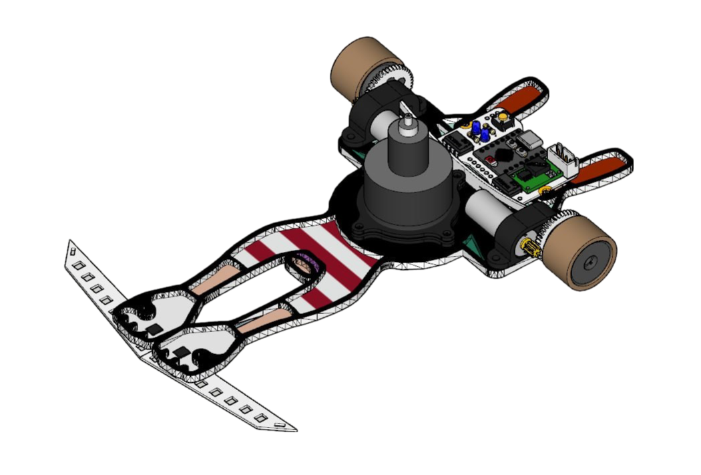

# BaraBaraCar-PX-01 Linefollower

Basado en el kit de OPR.

Robot siguelineas modular. Está pensado para tener un diseño sencillo a la par que lo mas competitivo posible. Con 16 sensores IR, succión y motores de gran poder.

[Más información y conjunta](http://oprobots.github.io/tienda/kits/px-01/ "Más información y conjunta")

*en construcción*